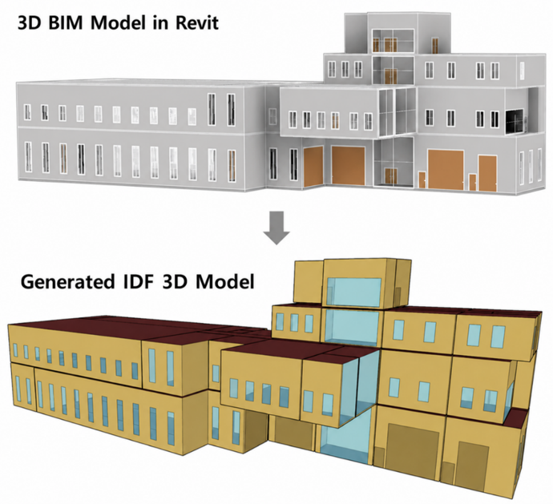

# LLM-Assisted BIM2BEM

This repository contains the reproducibility materials for an LLM-assisted
building information modeling to building energy modeling (BIM2BEM) workflow.
The workflow converts IFC-based BIM information into an EnergyPlus input data
file (IDF) through explicit geometry-processing and energy-parameter
enrichment stages.

The package supports inspection of the case-study workflow, the generated IDF,
and the independently created manual reference IDF used in the manuscript
comparison. It is a reproducibility package for the reported case study, not a
general-purpose or fully validated BIM2BEM application.

## Repository Contents

    .
    +-- BIM2BEM_Input_Output  IFC input and intermediate workflow outputs
    +-- BEM_Models            LLM-generated and manual-reference EnergyPlus models
    +-- GPTs                  Custom GPT configuration and knowledge files
    +-- Images                Visual workflow and geometry-comparison figures
    +-- Weather_Data          EPW and DDY files used for the case-study simulation
    +-- CITATION.cff           Repository citation metadata
    +-- THIRD_PARTY_NOTICES.md Attribution and source notes for included references
    +-- LICENSE                MIT license for original repository materials
    +-- README.md              This guide

Each directory contains a README describing its contents and role in the
workflow.

The GPT workflow packages also contain illustrative case-study screenshots of
the prompts and outputs for the reported stages. The machine-readable inputs,
scripts, and output artifacts remain the source of record for reproduction.

## Case-Study Workflow

1. Use BIM2BEM_Input_Output/Input/4StoryFactoryBuilding.ifc as the source IFC
   input file.
2. Configure the two custom GPT workflows from the packages in GPTs.
3. Run the geometry workflow to create intermediate geometry files and the
   initial Step 7 IDF.
4. Run the enrichment workflow to create the enriched IDF using traceable IFC,
   prototype, EnergyPlus-library, and retained Step 7 evidence as applicable.
5. Run the LLM-generated and manual reference IDFs with the same case-study
   weather data in EnergyPlus 9.6.
6. Inspect the IDFs and the accompanying CSV, HTML, and ERR result files in
   BEM_Models.

## Case-Study Geometry Result

The figure below illustrates the geometric transformation from the source
3D BIM model in Revit to the EnergyPlus IDF geometry generated by the
LLM-assisted BIM2BEM workflow.

  

## Software and Access Requirements

- EnergyPlus 9.6.0 for the supplied IDF models.
- Python 3 for the geometry helper scripts. The included scripts use Python
  standard-library modules.
- A ChatGPT account with custom GPT creation, Code Interpreter and Data
  Analysis enabled. Web Search is used by the enrichment workflow when an
  official reference source must be consulted.

Custom GPT share links are not required to inspect this package. The
instructions, helper scripts, and knowledge files needed to reconstruct the
two configurations are included under GPTs/.

## Scope and Data Notes

- The case-study building is represented by the included IFC input. The
  original native Revit model is not distributed in this repository due to the file size limit. It will be made available on request.
- The simulation location and weather data are provided for reproducibility of
  the reported case-study simulation; they do not establish the actual
  location of the building.
- The EnergyPlus Ideal Loads Air System is used for the supplied simulations.
  Reported heating and cooling quantities therefore represent zone thermal
  requirements, not HVAC equipment electricity or fuel consumption.
- The comparison evaluates agreement between the generated IDF and an
  independently created manual reference IDF. It is not a calibration or
  validation against measured building energy data.

## Citation

Please cite the associated journal article when using this repository. Citation
metadata for the repository are provided in CITATION.cff. The article DOI and
preferred article citation will be added after publication.

## License and Third-Party Materials

The MIT license applies to the original code and documentation in this
repository. EnergyPlus data sets, weather files, and prototype-model resources
remain subject to their respective upstream terms and attribution requirements;
see THIRD_PARTY_NOTICES.md.
